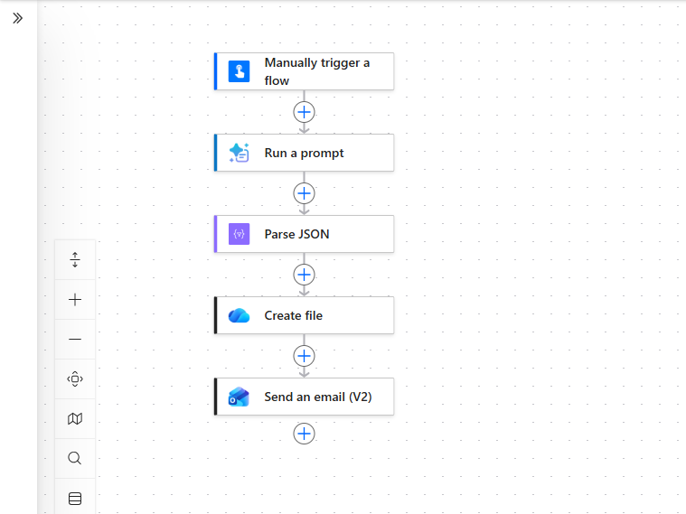
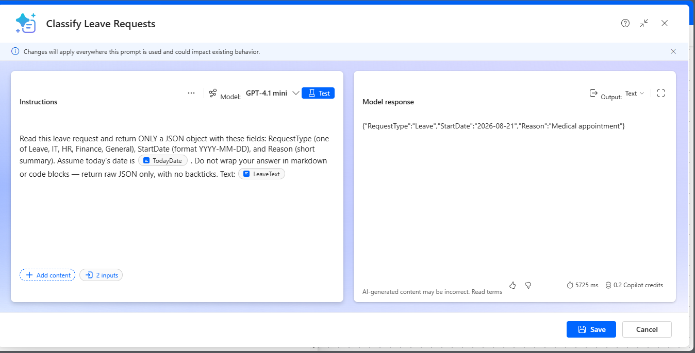
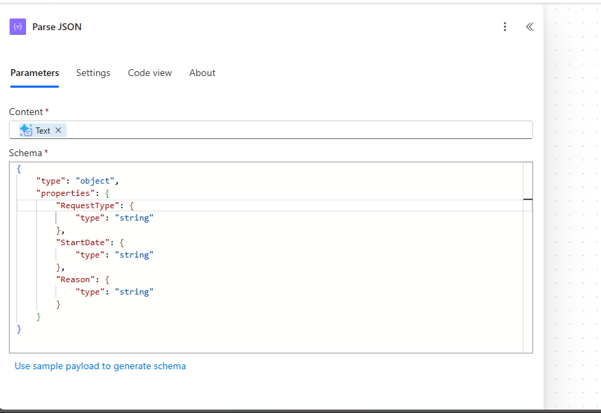
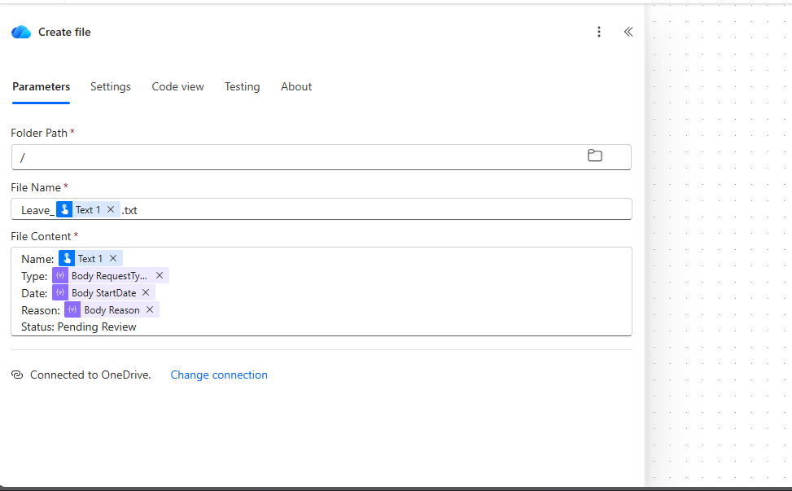
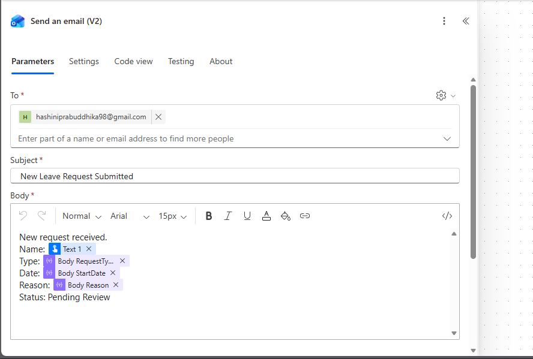

# AI-Powered Leave Request Automation

An end-to-end automation built with **Microsoft Power Automate** and **AI Builder** that classifies free-text leave requests, extracts structured data using AI, logs results, and sends notifications — demonstrating practical experience with the Microsoft Power Platform for business process automation.

## What it does

An employee describes a leave request in plain, natural language (e.g. *"I need leave next Friday because I have a medical appointment"*). The flow then:

1. **Reads the free text** via an instant/manual trigger (designed to also support Microsoft Forms intake)
2. **Classifies the request using AI** (AI Builder "Run a prompt", GPT-based) — extracting:
   - `RequestType` (Leave / IT / HR / Finance / General)
   - `StartDate` (calculated from natural language like "next Friday")
   - `Reason` (short summary)
3. **Parses the AI's JSON response** into structured fields
4. **Logs the request** as a timestamped file in OneDrive, creating an audit trail
5. **Sends an automatic email notification** summarizing the request

## Architecture

```
Manual Trigger (Leave Request Text)
        ↓
AI Builder — Run a Prompt (GPT classification)
        ↓
Parse JSON (structure the AI's output)
        ↓
Create File in OneDrive (audit trail)
        ↓
Send Email Notification
```

## Why this design

- **AI-driven classification** removes the need for employees to fill out rigid dropdown forms — they can describe their request naturally.
- **Dynamic date handling**: the prompt is fed the *actual current date* via a Power Automate expression (`formatDateTime(utcNow(),'yyyy-MM-dd')`), so relative phrases like "next Friday" resolve correctly every time the flow runs — rather than relying on a hardcoded date.
- **Structured JSON output**: the AI is explicitly instructed to return raw JSON with no markdown formatting, so it can be reliably parsed and used in downstream steps.

## What I'd add with more time / licensing

- **Microsoft Forms** as the intake method (built and tested, but blocked by a Forms license limitation on the trial tenant used for this project)
- **SharePoint or Dataverse** as the storage layer instead of OneDrive files, for better queryability
- **Copilot Studio agent** as a conversational front-end, so employees could submit requests via chat rather than a form
- **Approval step** with Teams adaptive cards for manager sign-off

## Notes on this build

This project was built on a free Microsoft 365 Developer trial tenant, which has limited AI Builder credits for **live flow execution** (separate from the unlimited credits available for testing/building prompts directly in the AI Builder studio). The AI classification logic was independently validated and confirmed working correctly (see `screenshots/ai-test-result.png`), returning accurate structured output such as:

```json
{
  "RequestType": "Leave",
  "StartDate": "2026-08-21",
  "Reason": "Medical appointment"
}
```

A full end-to-end flow run may show a credit-capacity error on this trial tenant; this reflects a licensing/quota constraint of the free trial environment rather than a fault in the flow's logic, which is fully built and saved.

## Screenshots

**Flow overview** — full 5-step automation from trigger to email notification


**AI classification test** — AI Builder correctly extracting request type, date, and reason from free text


**Parse JSON step** — schema generated to structure the AI's response for downstream use


**OneDrive storage step** — each request logged as a timestamped file for audit tracking


**Email notification step** — automatic summary email sent on each new request


**Run history** — flow execution log showing step-by-step status


## Tools used

Microsoft Power Automate · AI Builder (GPT-based prompt) · OneDrive · Outlook · Microsoft Forms · Power Apps (Dataverse table design)
